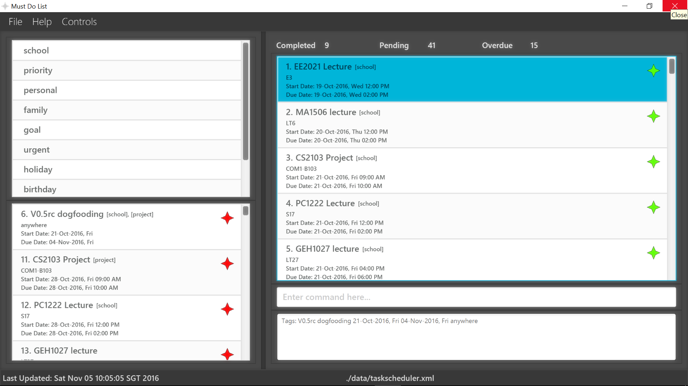

# Must Do List 

 

* This is a desktop Task Scheduler application developed by students from [School of Computing, National University of Singapore] for the module CS2103 

#### Site Map
* [User Guide](docs/UserGuide.md) 
* [Developer Guide](docs/DeveloperGuide.md) 
* [Learning Outcomes](docs/LearningOutcomes.md) 
* [About Us](docs/AboutUs.md)
* [Contact Us](docs/ContactUs.md)
* [Test Script](src/test/data/ManualTesting/TestScript.md)

#### Acknowledgements

* Some parts of this sample application were inspired by the excellent 
  [Java FX tutorial](http://code.makery.ch/library/javafx-8-tutorial/) by *Marco Jakob*. 

* This is an application that has been refractored from addressbook-level4 application forked from nus-cs2103-AY1617S1.
(https://github.com/nus-cs2103-AY1617S1/addressbook-level4)

#### Licence : [MIT](LICENSE)
