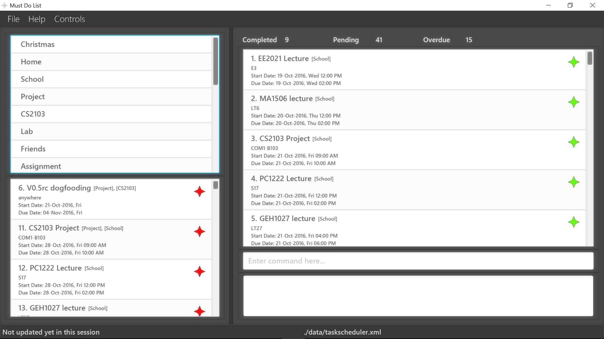
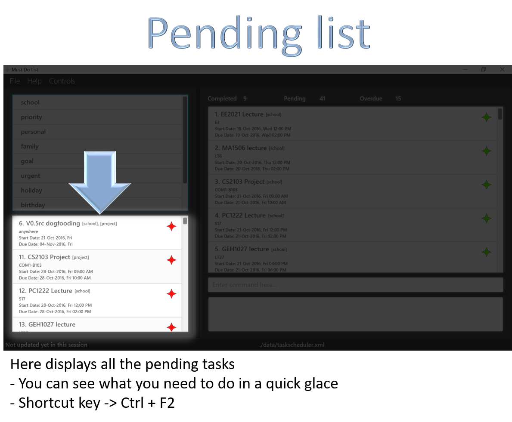
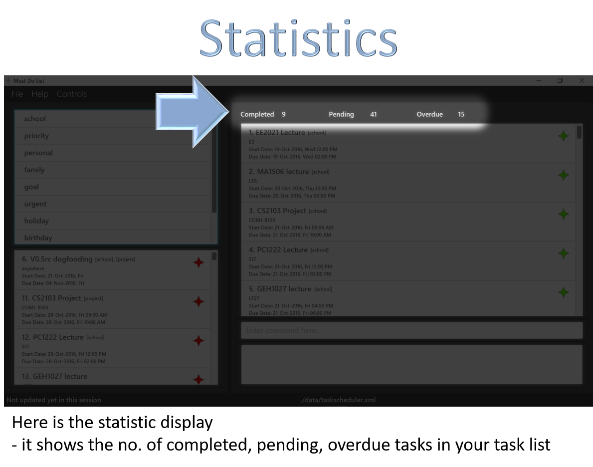
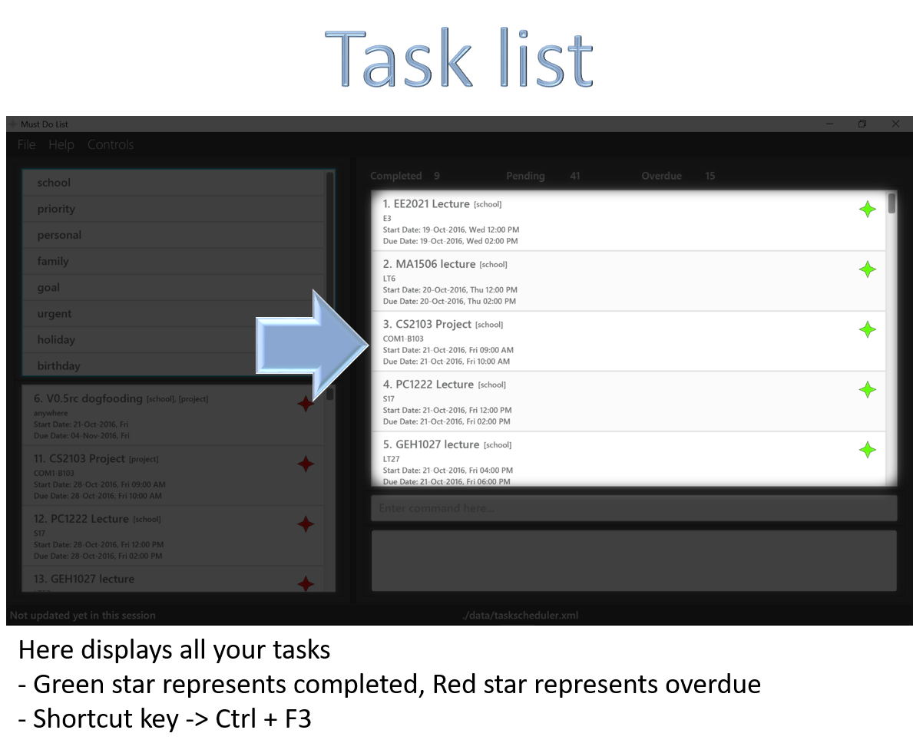
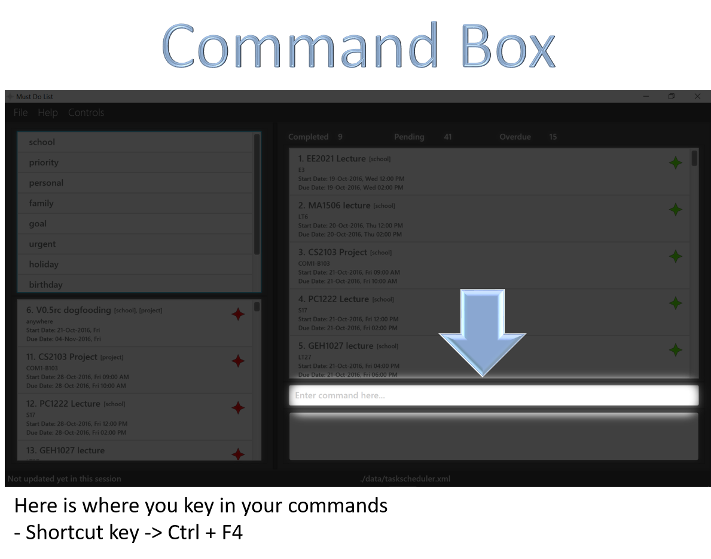
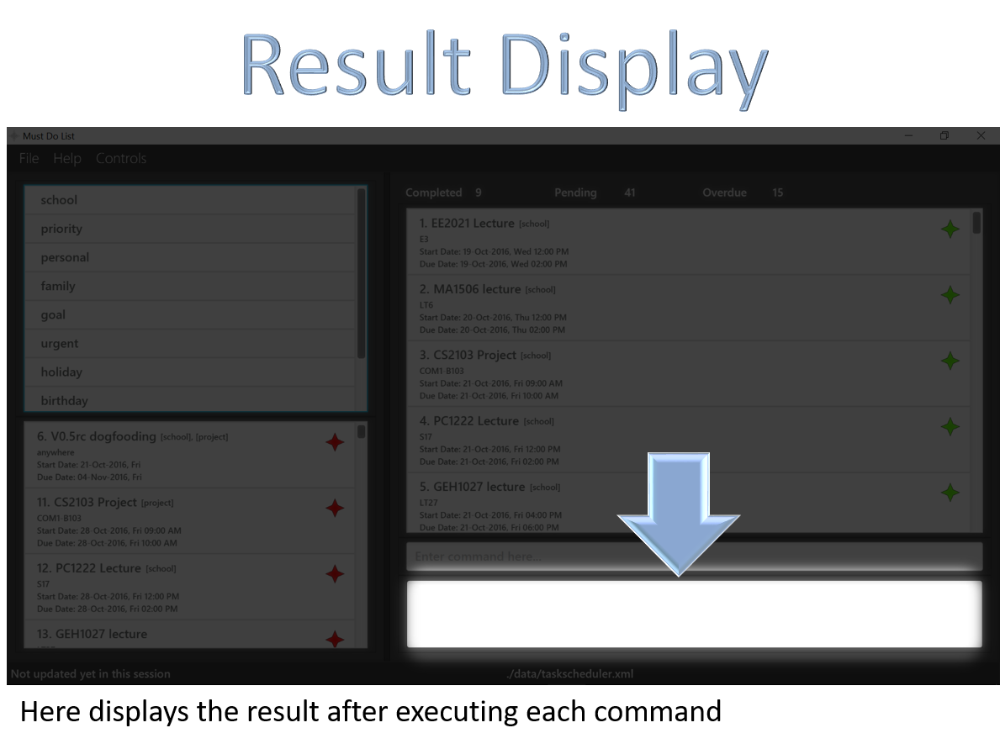
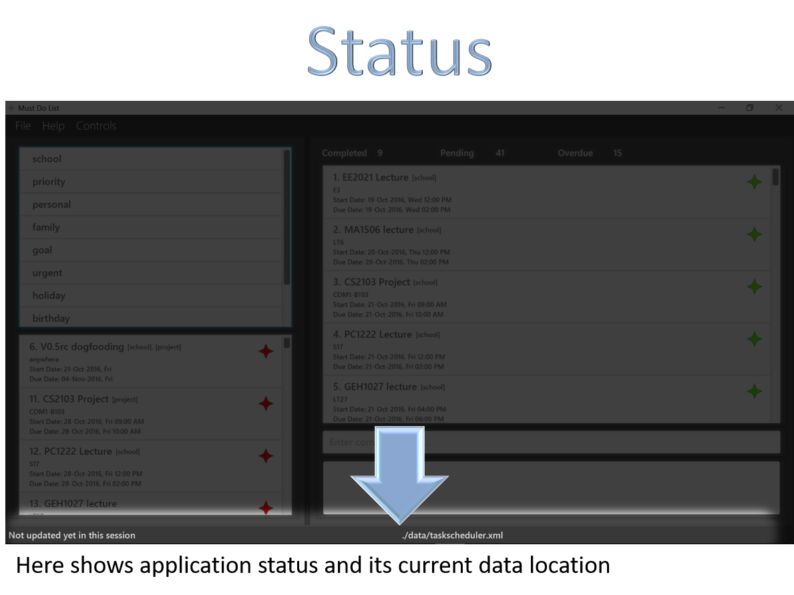

<!-- @@author A0148145E -->

# Manual Testing

* [Setting Up](#setting-up)
* [UI Quick Guide](#ui-quick-guide)
* [Get Started](#get-started)
 * [Help](#getting-help--help)
 * [Add](#how-to-add-a-task--add)
 * [List](#how-to-list-tasks--list)
 * [Find](#how-to-find-a-task--find)
 * [Delete](#how-to-delete-a-task--delete)
 * [Clear](#how-to-clear-all-entries--clear)
 * [Edit](#how-to-edit-a-task--edit)
 * [Replace](#how-to-replace-a-task--replace)
 * [Undo](#how-to-undo-a-task--undo)
 * [Mark](#how-to-mark-a-task--mark)
 * [Unmark](#how-to-unmark-a-task--ummark)
 * [Recur](#how-to-recur-a-task--recur)
 * [Setpath](#how-to-set-a-storage-path--setpath)
 * [Select](#how-to-select-a-task--select)
 * [Tag](#how-to-tag-a-task--tag)
 * [Exit](#how-to-exit-the-program--exit)
 * [Redo](#how-to-redo-a-task)
 * [Identify task](#how-to-identify-overdue-and-completed-task)
 * [Save](#how-to-save-the-data)
* [FAQ](#faq)
* [Command Summary](#command-summary)

## Setting Up

0. Ensure you have Java version `1.8.0_60` or later installed in your Computer. 
   > Having any Java 8 version is not enough. 
   This app will not work with earlier versions of Java 8.
   
1. Download the latest `MustDoList.jar` from the [Releases](https://github.com/CS2103AUG2016-F09-C2/main/releases) 
   & SampleData.xml from [Here](https://raw.githubusercontent.com/CS2103AUG2016-F09-C2/main/test-script/src/test/data/ManualTesting/SampleData.xml)

2. Save the files to the folder you want to use as the home folder for your MustDoList.

3. Double-click the MustDoList.jar to start the app. The GUI should appear in a few seconds. 
   > 

4. Type the command in the command box and press <kbd>Enter</kbd> to execute it.  
   e.g. typing **`help`** and pressing <kbd>Enter</kbd> will open the help window. 
   If you need help understanding our UI, checkout our [UI Quick Guide](#ui-quick-guide)
   
5. To import the SampleData.xml, type "import FILE_LOCATION"
   e.g. `import C:\V0.5\data\SampleData.xml`
   e.g. `import data/SampleData.xml`
   
[[Return to Top]](#manual-testing)

## UI Quick Guide

 
 
 
 
 
 
 

[[Return to Top]](#manual-testing)

---

## Get Started

### Steps to perform manul testing : 

#### The instructions will be in this format

<b>Command</b> : The command to type and press enter  
<b>Show</b> :  
Visual changes  
<b>Result</b> :  
Result in result display  

#### The instructions will be accompanied by an undo command 

To demostrate that all our commands (except for help, exit and import command) 
can be undo 

- Goes back to original 
means all data should return to the state before the previous command is executed

[[Return to Top]](#manual-testing)

### Adding tasks

<b>Command</b> : add SoC Event from 9 am to 12 pm at COM1-Level 2  
<b>Show</b> :  
Highlights the task added in task list  
Pending task count increase by 1 
<b>Result</b> :  
New task added: SoC Event [TODAY'S DATE, DAY] 09:00 AM [TODAY'S DATE, DAY] 12:00 PM COM1-Level 2  

<b>Command</b> : undo  
<b>Show</b> :  
Goes back to original  
<b>Result</b> :  
Revert add command: 
SoC Event [TODAY'S DATE, DAY] 09:00 AM [TODAY'S DATE, DAY] 12:00 PM COM1-Level 2  

<b>Command</b> : add submit CS2103 manual scripted testing by 7 Nov 23:59  
<b>Show</b> :  
Highlights the task added in task list  
Pending task count increase by 1 
<b>Result</b> :  
New task added: submit CS2103 manual scripted testing  07-Nov-2016, Mon 11:59 PM 

<b>Command</b> : undo  
<b>Show</b> :  
Goes back to original  
<b>Result</b> :  
Revert add command:  
submit CS2103 manual scripted testing  07-Nov-2016, Mon 11:59 PM 

<b>Command</b> : add browse for new phone  
<b>Show</b> :  
Highlights the task added in task list  
<b>Result</b> :  
New task added: browse for new phone 

<b>Command</b> : undo  
<b>Show</b> :  
Goes back to original  
<b>Result</b> :  
Revert add command:  
browse for new phone 

[[Return to Top]](#manual-testing)

---

#### Find tasks

<b>Command</b> : find event  
<b>Show</b> :  
Pending list and Task list will show the tasks matching the description  
Statistics update - should show 9 Completed, 16 Pending. Overdue is dependant on the date of testing 
<b>Result</b> :  
25 tasks listed!  

Command : 
`undo`
Result : 
- Goes back to original
Show :
`Listed all tasks`

Command : 
`find MA1506`
Show :
- Pending list and Task list will show the tasks matching the description
- Statistics update - should show 2 Completed, 3 Pending. Overdue is dependant on the date of testing
Result : 
`5 tasks listed!` 

Command : 
`undo`
Show :
> Goes back to original
Result : 
`Listed all tasks`

Command : 
`find floating`
Show :
- Pending list and Task list will show the tasks matching the description
- Statistics update - should show 0 Completed, 15 Pending, 0 Overdue
Result : 
`15 tasks listed!`

[[Return to Top]](#manual-testing)

#### List tasks

Command : 
`list`
Show :
- Pending list and Task list will show all the tasks
- Statistics update - should show 9 Completed, 41 Pending. Overdue is dependant on the date of testing
Result :
`Listed all tasks` 

[[Return to Top]](#manual-testing)

---

#### Delete tasks

Command : 
`delete 1`
Show : 
- Completed task count decrease by 1
- No. 1 Task removed from Task list
Result :
`Deleted Task: EE2021 Lecture 19-Oct-2016, Wed 12:00 PM 19-Oct-2016, Wed 02:00 PM E3`

Command : 
`undo`
Show :
- Goes back to original
- Highlights the No. 1 Task
Result : 
`Revert delete command: 
EE2021 Lecture 19-Oct-2016, Wed 12:00 PM 19-Oct-2016, Wed 02:00 PM E3`

Command : 
`delete 6`
Show :
- Pending task count decrease by 1
- No. 6 Task removed from Task & Pending list
- CS2103 tag removed from Tag list
Result : 
`Deleted Task: V0.5rc dogfooding 21-Oct-2016, Fri 04-Nov-2016, Fri anywhere`

Command : 
`undo`
Show :
- CS2103 tag added back to tag list
- Deleted task added back to Task & Pending list
- Highlights the No. 6 Task
Result : 
`Revert delete command: 
V0.5rc dogfooding 21-Oct-2016, Fri 04-Nov-2016, Fri anywhere`

[[Return to Top]](#manual-testing)

---

#### Clear tasks

Command : 
`clear`
Show :
- Completed, Pending, Overdue task count goes to 0
- All tasks removed from Task & Pending list
- All tags removed from Tag list
Result : 
`Task scheduler has been cleared!` 

Command : 
`undo`
Show :
- Goes back to original
Result : 
`Revert clear command: 
EE2021 Lecture 19-Oct-2016, Wed 12:00 PM 19-Oct-2016, Wed 02:00 PM E3
...
...
...`
All the tasks that was deleted

---

#### Edit tasks

Command : 
`edit 6 V0.5 dogfooding by 7 Nov at everywhere`
Show :
- Highlights the editted task in task list
- Task's name changes to V0.5 dogfooding
- Task's due date changes to 07-Nov-2016, Mon
- Task's address changes to everywhere
Result : 
`Task editted: V0.5rc dogfooding 21-Oct-2016, Fri 04-Nov-2016, Fri anywhere` 
- Display the task details before edit for comparison

Command : 
`undo`
Show :
- Goes back to original
- Highlights the No.6 task
Result : 
`Revert edit command: 
V0.5 dogfooding 21-Oct-2016, Fri 07-Nov-2016, Mon everywhere`

Command : 
`edit at everywhere`
Show :
- Highlights the No.6 task
- No.6 task's location changes to everywhere
Result : 
`Task editted: V0.5rc dogfooding 21-Oct-2016, Fri 04-Nov-2016, Fri anywhere` 
- Display the task details before edit for comparison

Command : 
`undo`
Show :
- Goes back to original
- Highlights the No.6 task
Result : 
`Revert edit command: 
V0.5 dogfooding 21-Oct-2016, Fri 07-Nov-2016, Mon everywhere`

#### Replace tasks 

Command : 
`replace 1 EE2021 Exam on 29-Nov 9 am`
Show :
- Highlights the new task
- New task only contains name and due date
- Adds the new task to pending list
- Pending task count increase by 1
- Completed task count decrease by 1
Result : 
`Task replaced: EE2021 Lecture 19-Oct-2016, Wed 12:00 PM 19-Oct-2016, Wed 02:00 PM E3` 
- Display the task details before replace for comparison

Command : 
`undo`
Show :
- Goes back to original
- Highlights the No. 1 Task
Result : 
`Revert replace command: 
EE2021 Exam  29-Nov-2016, Tue 09:00 AM`

[[Return to Top]](#manual-testing)

---

#### Mark tasks

> Command : 
`mark 6`
Show :
- Highlights the No. 6 task
- Star changes from Red to Green (Overdue to Completed)
- Removes the task from pending list
- Pending task count decrease by 1
- Overdue task count decrease by 1
- Completed task count increase by 1
Result : 
`Completed Task: V0.5rc dogfooding 21-Oct-2016, Fri 04-Nov-2016, Fri anywhere` 

Command : 
`undo`
Show :
- Goes back to original
- Highlights the No. 6 Task
Result : 
`Revert mark command: 
V0.5rc dogfooding 21-Oct-2016, Fri 04-Nov-2016, Fri anywhere`

Command : 
`mark 1`
Show :
- Nothing happens
Result : 
`This task is already completed.`

[[Return to Top]](#manual-testing)

---

#### Unmark tasks

Command : 
`unmark 3`
Show :
- Highlights the No. 3 task
- Star changes from Green to Red (Completed to Overdue)
- Adds the task to pending list
- Pending task count increase by 1
- Overdue task count increase by 1
- Completed task count decrease by 1
Result : 
`Un-Completed Task: CS2103 Project 21-Oct-2016, Fri 09:00 AM 21-Oct-2016, Fri 10:00 AM COM1-B103` 

Command : 
`undo`
Show :
- Goes back to original
- Highlights the No. 3 Task
Result : 
`Revert unmark command: 
CS2103 Project 21-Oct-2016, Fri 09:00 AM 21-Oct-2016, Fri 10:00 AM COM1-B103`

Command : 
`unmark 1`
Show :
- Nothing happens
Result : 
`This task is not completed.`

[[Return to Top]](#manual-testing)

---

#### Recur tasks

[[Return to Top]](#manual-testing)

---

#### Select tasks
  
[[Return to Top]](#manual-testing)

---

#### Undo commands
[[Return to Top]](#manual-testing)

---

#### Tag tasks
  
  
[[Return to Top]](#manual-testing)

---

#### How to exit the program : `exit`
The `exit` command allows you to exits the program. 

Exit format: `exit` 

[[Return to Top]](#manual-testing)

---

## FAQ

**Q**: How do I transfer my data to another Computer? 
**A**: Install the app in the other computer and overwrite the empty data file it creates with the file that contains the data of your previous MustDoList.
   
[[Return to Top]](#manual-testing)
   
---
 
## Command Summary

* Help: `help`

* Add: **`add`**`FLOATING TASK NAME` 
**`add`**`TASK NAME by END_TIME END_DATE`  
**`add`**`EVENT NAME from START_TIME_DATE to END_TIME_DATE at LOCATION` 
e.g. **`add`**`Do CS2103 Pretut` 
e.g. **`add`**`Do CS2103 Pretut by 8am 01-Oct-2016` 
e.g. **`add`**`CS2103 Tutorial from 8am today to 9am tomorrow at NUS COM1-B103`

* List: `list`

* Find: **`find`**`KEYWORD` 
e.g. **`find`**`CS2103`

* Delete: **`delete`**`[INDEX]` 
e.g. **`delete`**`1`

* Clear: `clear`

* Edit: **`edit`**`[INDEX] [EVENT_NAME][from START_TIME_DATE to END_TIME_DATE][at LOCATION]` 
e.g. **`edit`**`1 Must Do CS2103 Pretut` 
e.g. **`edit`**`2 at NUS COM1-B103` 
e.g. **`edit`**`1 from 8am 11-Oct-2016 to 9am 11-Oct-2016`

* Replace: **`replace`**`[INDEX] EVENT_NAME from START_TIME_DATE to END_TIME_DATE at LOCATION` 
e.g. **`replace`**`2 new task name from 8am 10-Oct-2016 to 9am 10-Oct-2016 at NUS` 

* Undo: `undo`

* Mark: **`mark`**`[INDEX]` 
e.g. **`mark`**`1`

* Unmark: **`unmark`**`[INDEX]` 
e.g. **`ummark`**`1`

* Recur: **`recur`**`[INDEX] every INTERVAL until END_DATE` 
e.g. **`recur`**`every 2 days until 19-Oct-2016`

* SetPath: **`setpath`**`FILENAME` 
e.g. **`setpath`**`taskData`

* Select: **`select`**`INDEX` 
e.g. **`select`**`1`

* Tag: **`tag`**`[INDEX] TAG_NAME...` 
e.g. **`tag`**`1 project priority`

* Exit: `exit`

* <kbd>Up</kbd> <kbd>Down</kbd>: system display and select previously keyed commands

* ColorCode: system indicate overdue(red) and completed(green) task by color code

* Save: system save automatically

[[Return to Top]](#manual-testing)

